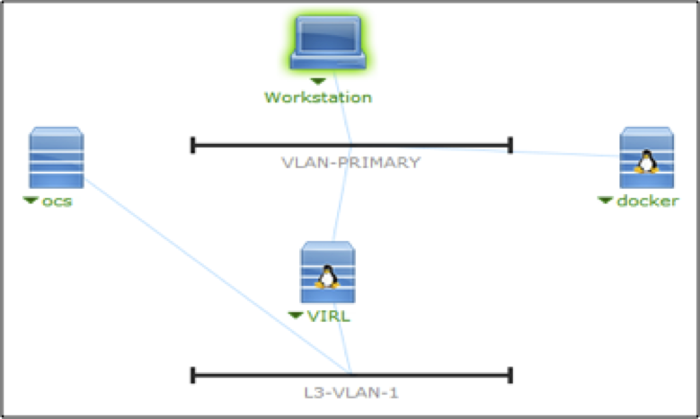
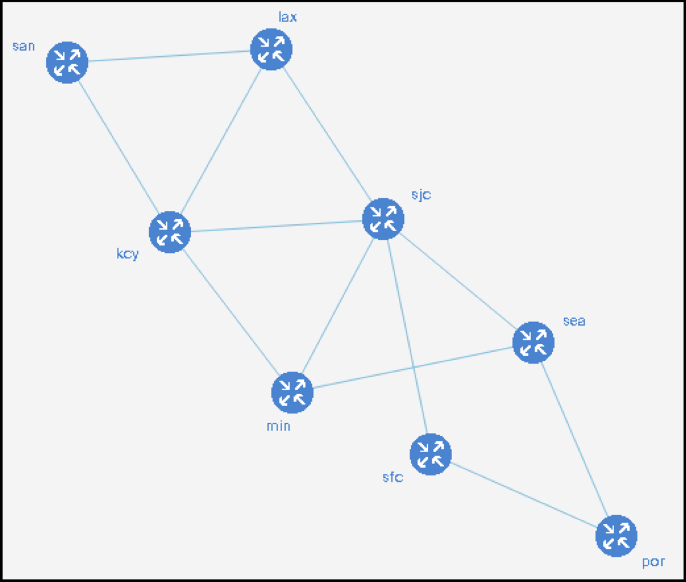
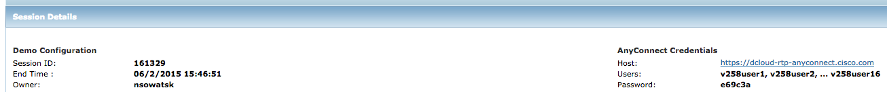
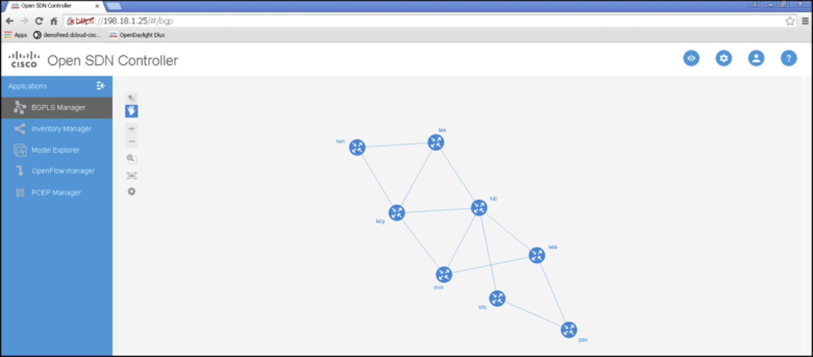
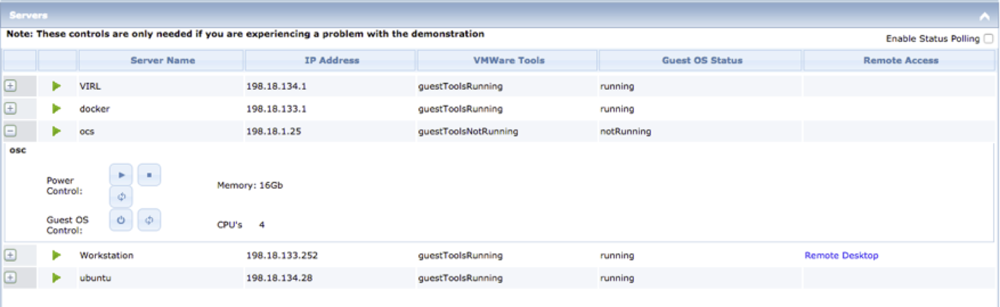

Welcome to the DevNet learning lab for the Cisco Open SDN Controller 1.0 Sandbox v2.1, with Python!

# Step 1 About This Cisco Solution
The Cisco Open SDN Controller (COSC) is a commercial distribution of [OpenDaylight](http://http://www.opendaylight.org) that delivers business agility through automation of standards-based network infrastructure.

Built as a highly scalable software-defined networking (SDN) platform, the Open SDN Controller abstracts away the complexity of managing heterogeneous networks to improve service delivery and reduce operating costs.

With the Cisco Open SDN Controller, you can integrate business applications with the underlying network devices using Northbound Rest APIs.  The Rest APIs provide a list of supported base network functions, which are agnostic of the underlying network device manufacturer.

Developer support for COSC may be found in the [COSC community at DevNet.](https://communities.cisco.com/community/developer/networking/cisco-one/extensible-network-controller)

## About This Learning Lab
This learning lab is part of a series of such labs offered by Cisco's [DevNet](http://developer.cisco.com). More such labs are to be found at the [Learning Labs section of DevNet](https://developer.cisco.com/site/devnet/learningLabs/overview.gsp). The code for this lab may be found in the [DevNet organisation in GitHub](https://github.com/CiscoDevNet/cosc-learning-labs). 

These instructions are for a specific instance of the learning lab hosted on [Cisco's dCloud platform](http://dcloud.cisco.com). If you have a dCloud account, you can access this learning lab at any time as part of the "Cisco Open SDN Controller 1.0 with Python Sandbox v1". If you do not have a dCloud account yourself, please contact your Cisco account manager or systems engineer and they will be able to arrange access for you.

## About This Demonstration
The purpose of this Sandbox is to give you access to the Cisco Open SDN controller. This will take your through the steps of accessing the new Open SDN Controller and then allow you to self-discover different aspects of this product. It will also walk you through using Python to interact with the Open SDN Controller.

## Demonstration Configuration

This learning lab contains preconfigured users and components, running on the [Cisco VIRL](http://virl.cisco.com) platform.
 
All information needed to complete the access components is located in the Topology and Servers menus of your active demonstration. You will not normally need to access these views unless you need to restart servers or similar, which would be unusual, but see "Troubleshooting" below.

* Topology Menu. Click on any server in the topology and a popup window will appear with available server options.
* Servers Menu. Click on the green triangle in the Topology View, or '+' next to any server name in the Servers view, to display the available server options and credentials.

## Demonstration Topology
When accessing the demo, you will see a simplified topology, as shown in the figure below: 

 
This demonstration uses Virtual Internet Routing Lab [(VIRL)](http://virl.cisco.com). VIRL is a multi-purpose network virtualization platform that provides an easy way to build, configure, and test new or existing network topologies with an intuitive user interface. 

The VIRL topology used for this demonstration, depicted as a single server above, actually consists of eight routers interconnected within the topology. Each router has a management interface connected to the OSC server. Both VIRL and OSC run as Virtual Machines (VMs) on ESXi.

For additional information on VIRL, see this [VIRL video at YouTube.](http://www.youtube.com/watch?v=nsbzHmwUz6I)

## Accessing the Open SDN Controller
Demonstration Steps:

1. Ensure that AnyConnect is connected to the dCloud lab. See the "Session Details" tab of the dCloud demo, or consult your lab proctor. See below for an illustration.

2. Access the Open SDN Controller GUI using the Chrome browser at http://198.18.1.25
3. Use the login credentials admin/cisco123 and click Login.
4. Welcome to the Open SDN Controller GUI --- Explore!

 
Caveats: 
* At this time, you are not be able to use the GUI interface to access router configurations; however, you can telnet into the routers using an ssh client.
* Please disregard any geographical issues you may find.
* XRv devices, accessed via Netconf from the controller, do appear in the inventory after they are mounted, but no device details are shown. 

## Python DevNet Learning Lab
When using the Cisco Open SDN Controller, you can access APIs that are generated from Yang models and exposed via [“RESTCONF”](https://tools.ietf.org/html/draft-ietf-netconf-restconf-04). 

This lab will show you how to call those APIs via Python. The Python code here is presented as a series of scripts that you can run on an Ubuntu VM, available via `ssh cisco@198.18.134.28`. The password is C1sco12345. When you log in, a script will be run to update the VM for this exercise, and so you will need to provide the password so that the script can run with sudo permissions. You can look at the end of the ~/.bashrc file to see what is happening if you are curious.

The scripts (and this document) come from this project in GitHub: 

https://github.com/CiscoDevNet/cosc-learning-labs

On the Dev VM those scripts have been “cloned” into in the ~/git/cosc-learning-labs/src/learning_lab directory. The setup script will put you into that directory automatically and set the appropriate environment variables. If anything below does not work as expected, see the “Troubleshooting” section below.

You will then be able to run scripts in the lab, with the following steps of the labs.

## Next Steps

If you want to modify the list of devices being mounted, edit the ../settings/dcloud.py file. That file is Python code as well.

You can also use the inbuilt Python interpreter to call the functions in the basics library, in the same way that the code in the learning_lab directory does, and, if you are working on your own copy of the code, i.e. not a shared lab, you can adapt and modify any of the scripts that you as you like. Feel free to experiment with the code. If you break it, you can pull a new copy of the code from the Git repositry. You will not break anything except your own copy of the lab.

Have at it! 

The Cisco DevNet team – developer.cisco.com.

## Troubleshooting

Some problems that can arise when working with the Open SDN Controller are discussed below:

* Devices mount, but do not connect. It is possible that the devices do not have cryptographic keys installed, and/or that the netconf-yang agent has not been configured. To fix, use VMMaestro in the RDP to telnet to the device, login as "cisco/cisco", enter "crypto key generate dsa", and accept the defaults. Then enter configuration mode, "conf t", and enable the netconf-yang agent, "netconf-yang agent ssh", followed by "commit" and then "end".	
* Chrome caches the progress bar and does not move beyond that when accessing the GUI of the controller. If you have Firefox available, then use that.
* The controller becomes un-responsive, or responds with 50X errors. This can happen for a variety of reasons, and the simple remedy is to reboot the controller VM as shown below.
* The network is in some state, with routes, ACLs, interfaces shutdown, or similar, probably because of a previous series of exercises with the same lab instance, that leads to unexpected results. In this case there is a `restore_network_state.py` script that should reset everything and leave the controller with no mounted devices. If this script does not work, reboot the controller server and try again after five minutes.

The controller “ocs” server can be rebooted from the “Servers” section of your dCloud Dashboard as shown below. Click on the “+” symbol next to the “ocs” server entry, and then select the bottom right “Reboot Guest” button, which has a symbol of circled arrows. 

This reboot will take approximately five minutes.