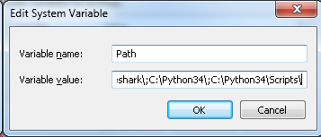
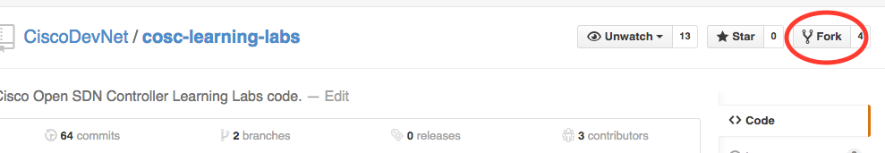
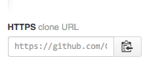
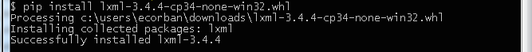
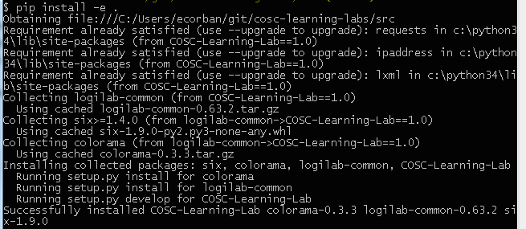

To work on this lab on your own machine, you will need to install [Python](https://www.python.org/downloads/) and 
[Pip](https://pip.pypa.io/en/latest/installing.html), and clone the project code.

Once you have done that, the project uses standard Python mechanisms, Pip with the `src/setup.py` script, and [virtualenv](https://virtualenv.pypa.io/en/latest/) as required, to install all other required components, as explained below.

When your environment is setup correctly, you should create a network profile, in the `src/settings` directory and set that via the NETWORK-PROFILE environment variable, as described below.

#Windows
Mac OS X and Linux are quite similar in how one uses them for development. Windows has its own personality when it comes to developer tools though, so we have to treat Windows specially in these instructions. One of the very useful tools, which, if you are a Windows user you should install *now*, is [GitBash](https://github.com/msysgit/msysgit/releases/). GitBash usefully provides both a Git client *and* a Bash shell. Also see this guide to [installing GitBash](https://openhatch.org/missions/windows-setup/install-git-bash). The instructions we provide below for Windows work with GitBash.

#Install Python
Whilst the code will work with Python 2.7, we recommend that you install Python 3.x for your operating system.
Download the installer here: https://www.python.org/downloads/.

On Windows Python is installed by default in `C:\Python34` (for Python 3). After having installed Python, you will need to add that location, and the location of the Scripts sub-directory (for Pip) to your path, as shown below.

 

##Check Your Python install
If you are using Mac OS X or Linux, enter `python3` to check the version, and expect to see something like:

```bash
$ python3 
Python 3.4.3 (v3.4.3:9b73f1c3e601, Feb 23 2015, 02:52:03) 
[GCC 4.2.1 (Apple Inc. build 5666) (dot 3)] on darwin
Type "help", "copyright", "credits" or "license" for more information.
>>> ^D
```
The `^D` shown above exits from the Python shell.

On Windows, open a Bash shell with GitBash and enter `python` at the CLI to check the Python version. If you have only installed Python3, and you have set the path as illustrated above, you should expect to see something like the example below.

 

# Install Pip
Pip is the [PyPA recommended tool](https://python-packaging-user-guide.readthedocs.org/en/latest/current.html) for installing Python packages. 

To install Pip for Python 3 on Mac OS X or Linux, use these commands at the CLI:

```bash
$ curl -O https://raw.githubusercontent.com/pypa/pip/master/contrib/get-pip.py
$ sudo python3 get-pip.py
```

And expect to see something like this:

```bash
$ curl -O https://raw.githubusercontent.com/pypa/pip/master/contrib/get-pip.py
  % Total    % Received % Xferd  Average Speed   Time    Time     Time  Current
                                 Dload  Upload   Total   Spent    Left  Speed
100 1387k  100 1387k    0     0   346k      0  0:00:04  0:00:04 --:--:--  346k

$ sudo python3 get-pip.py
Password:
...
Collecting pip
  Downloading pip-6.1.1-py2.py3-none-any.whl (1.1MB)
    100% |████████████████████████████████| 1.1MB 446kB/s 
Installing collected packages: pip
  Found existing installation: pip 6.0.8
    Uninstalling pip-6.0.8:
      Successfully uninstalled pip-6.0.8
Successfully installed pip-6.1.1
```

On Windows, Pip comes with Python 3.4, and is in the `Scripts` sub-directory of the Python install directory. If you added the `C:\Python34\Scripts` directory to your path as shown above, then you should be good.

# Installing Git
[Git](http://git-scm.com/) is a source code management (SCM) tool. There are many [Git UI tools available](http://git-scm.com/downloads/guis). The Git CLI client is installed with one of the platform specific [Git downloads](http://git-scm.com/downloads).

On Windows, you can use GitBash as recommended above. 

# Cloning the Code
Assuming you have a Git client installed, you can clone the project code. If you do not have a Git Client, see above. For a project hosted in GitHub, such as the [COSC Learning Lab](https://github.com/CiscoDevNet/cosc-learning-labs) you can [fork a repository](https://help.github.com/articles/fork-a-repo/) using the "Fork" button at the top right of a project page, as illustrated below.

 

Or you can just clone the project using the URL copied to the clipboard as shown below:



The command to use the URL is the same for Linux, Max OS X or Windows. By convention, one clones Git projects into the `git` sub-directory of one's `$HOME` directory. These commands will work with a shell on Linux or Mac OS X and a GitBahs shell on windows:

```bash
$ cd $HOME
$ mkdir git
$ cd git
$ git clone <repository URL>
```

# Setting Up the Environment
Having installed Python and Pip, on Linux and Mac OSX you can then use `pip3 install -e` in the project `src` directory, which, in turn, uses the contents of the `setup.py` script to install required components in your environment. 

On Windows, you will likely need to install the `lxml` library manually, and then run the `pip install -e .` command, as shown below. The pre-packaged binaries can be obtained from [Christoph Gohlke's Unofficial Windows Binaries for Python Extension Packages site](http://www.lfd.uci.edu/~gohlke/pythonlibs/#lxml), and then follow the [Installing from Wheels guide](https://pip.pypa.io/en/latest/user_guide.html#installing-from-wheels).



Then, on Windows, you can run the `pip install -e .` command, as shown below:



On Mac OS X, you can use [Home Brew](http://brew.sh/) to install the 'lxml' package, which will put in place the header files needed to complete the `pip` install below. This requires a few additional steps as illustrated below:

```bash
$ brew install libxml2
$ sudo ln -s /usr/local/Cellar/libxml2/2.9.2/include/libxml2 /usr/include/libxml2
```

The latter step, with the symbolic link for the directory, is required as the `pip` install looks for the `libxml2` header file in `/usr/include/libxml2`.

The outcome, of running the `pip install -e .` command, is that the Python packages of this project will be appended to the Python *path*, and all required packages will be downloaded and appended to the Python *path*.

On Linux and Mac OS X, There are two suggested techniques for achieving the required integration:
* Modify the current Python environment of your computer, which is suitable for a Dev VM, say, which would only be used for single project.
* Create and modify a virtual, temporary Python environment, which is recommended when you have multiple projects being developed in parallel on your own laptop, say. 

Note that the first option below, which has to be run as `sudo` will create a `src/COSC_Learning_Lab.egg-info` owned by root. If you choose the vitualenv option below, then you will need to delete the `COSC_Learning_Lab.egg-info` directory owned by root first.

##Modify the Current Python Environment of Your Computer
This technique is recommended when your computer is a virtual computer, such as Ubuntu running on VMWare, dedicated to this single project. The commands below should be run from the `cosc-learning-labs/src` directory.

####Python 2
```bash
sudo pip install -e .
```
####Python 3
```bash
sudo pip3 install -e .
```

On Mac OS X or Linux, that looks like this (with an example from the COSC Learning Lab project being run in the `src` directory):

``` 
$ sudo pip3 install -e .
...
Obtaining file:...git/cosc-learning-labs/src
Collecting requests (from COSC-Learning-Lab==1.0)
  Downloading requests-2.7.0-py2.py3-none-any.whl (470kB)
    100% |################################| 471kB 1.1MB/s 
Collecting ipaddress (from COSC-Learning-Lab==1.0)
  Downloading ipaddress-1.0.7.tar.gz
Collecting lxml (from COSC-Learning-Lab==1.0)
  Downloading lxml-3.4.4.tar.gz (3.5MB)
    100% |################################| 3.5MB 146kB/s 
    Building lxml version 3.4.4.
    Building without Cython.
    Using build configuration of libxslt 1.1.28
  ...
Installing collected packages: COSC-Learning-Lab, lxml, ipaddress, requests
  Running setup.py develop for COSC-Learning-Lab
    Creating /Library/Frameworks/Python.framework/Versions/3.4/lib/python3.4/site-packages/COSC-Learning-Lab.egg-link (link to .)
    Adding COSC-Learning-Lab 1.0 to easy-install.pth file
  Running setup.py install for lxml
    Building lxml version 3.4.4.
    Building without Cython.
    Using build configuration of libxslt 1.1.28
    building 'lxml.etree' extension
...  
Running setup.py install for ipaddress

Successfully installed COSC-Learning-Lab ipaddress-1.0.7 lxml-3.4.4 requests-2.7.0
```

##Create and Modify a Virtual, Temporary, Python Environment
This technique is recommended when your computer is used to run multiple Python projects or multiple versions of Python. If you have already used the previous option to setup your global environment, then you don't need to do this too.

There are multiple tools that provide a virtual environment. The example below uses [virtualenv](https://virtualenv.pypa.io/en/latest/). See also: [venv](https://docs.python.org/3/library/venv.html), [pyenv](https://github.com/yyuu/pyenv), [pythonz](https://github.com/saghul/pythonz).

On Ubuntu, Mac OS X and other Linux/Unix variants, the commands below should be run from the `cosc-learning-labs` directory:

```bash
$ sudo pip install virtualenv 
$ cd ~/git/cosc-learning-labs
$ virtualenv env

Using base prefix '/Library/Frameworks/Python.framework/Versions/3.4'
New python executable in env/bin/python3
Also creating executable in env/bin/python
Installing setuptools, pip...done.

$ source env/bin/activate

$ env/bin/pip3 install -e src

Obtaining file:///.../git/cosc-learning-labs/src
Collecting requests (from COSC-Learning-Lab==1.0)
  Using cached requests-2.7.0-py2.py3-none-any.whl
Collecting ipaddress (from COSC-Learning-Lab==1.0)
  Using cached ipaddress-1.0.7.tar.gz
Collecting lxml (from COSC-Learning-Lab==1.0)
  Using cached lxml-3.4.4.tar.gz
Collecting logilab-common (from COSC-Learning-Lab==1.0)
  Using cached logilab-common-0.63.2.tar.gz
Collecting six>=1.4.0 (from logilab-common->COSC-Learning-Lab==1.0)
  Using cached six-1.9.0-py2.py3-none-any.whl
Installing collected packages: requests, ipaddress, lxml, six, logilab-common, COSC-Learning-Lab
  Running setup.py install for ipaddress
  Running setup.py install for lxml
  Running setup.py install for logilab-common
  Running setup.py develop for COSC-Learning-Lab
Successfully installed COSC-Learning-Lab ipaddress-1.0.7 logilab-common-0.63.2 lxml-3.4.4 requests-2.7.0 six-1.9.0
(env)
```

To run the test suite:
```bash
$ cd ~/git/cosc-learning-labs/src
$ python3 setup.py test –a ../test
```
See also: [detailed instructions for testing](testing.md)

The `env/bin/activate` command, above, enters a shell or mode. When you are finished with the virtualenv:
```bash
$ deactivate 
```

#Creating and Setting the Network Profile
The network profile settings file defines variables and data that the learning lab code needs to identify the controller and network elements that are being used in a given instance of the lab. 

The first step us to set an environment variable, `NETWORK_PROFILE`, to the name of a settings fle. We shall use `learning_lab.py` in this example, which is based Mac OS X or Linux.

```bash
$ export NETWORK_PROFILE=learning_lab
```
The settings are read from the `settings` Python module, which is in:

```bash
~/git/cosc-learning-labs/src/settings
```

In this example, then, to display the settings:
```bash
$ cat ~/git/cosc-learning-labs/src/settings/learning_lab.py
```

Which would look like this for the open source [OpenDaylight Controller](http://www.opendaylight.org/) (yours may differ for IP addresses):

```python
odl_server_hostname = '198.18.1.25:8181'

odl_server_url_prefix = "http://%s/restconf/" % odl_server_hostname

config = {
    'odl_server' : {
        'url_prefix' : odl_server_url_prefix,
        'username' : 'admin',
        'password' : 'admin'},
 'network_device': {'kcy':{
                     'address': '198.18.1.50',
                     'port': 830,
                     'password': 'cisco',
                     'username': 'cisco'},
...
```
Which says that there is a controller at `198.18.1.25` with the REST API exposed on port `8181`, for which the credentials are "admin/admin", and that there is a network element, with a management IP address of `198.18.1.50`, managed via Netconf, on port 830, with the credentials "cisco/cisco". Note that the management network must be reachable from where the controller is running.

If you are using the commercial [Cisco Open SDN Controller](http://www.cisco.com/c/en/us/products/cloud-systems-management/open-sdn-controller/index.html), then you would have settings like this:

```python
odl_server_url_prefix = "https://%s/controller/restconf/" % odl_server_hostname

config = {
    'odl_server' : {
        'url_prefix' : odl_server_url_prefix,
        'username' : 'token',
        'password' : cosc_authentication_token(odl_server_hostname, 8181, 'admin', 'cisco123')},
...
```
Which uses an OAuth authentication token.

Using GitBash on Windows, and with a shell on Linux and Mac OS X, you should see something like:

```bash
$ export NETWORK_PROFILE=dcloud_v2
$ ./00_controller.py 
cosc authentication url: https://198.18.1.25/controller-auth
cosc authentication parameters:
   username = admin
   scope = sdn
   password = cisco123
   grant_type = password
cosc authentication status code: 201
odl_url_prefix: https://198.18.1.25/controller/restconf/
odl_username: token
odl_password: 798fb3d3-1a77-391c-b0b5-b6038297706f
status code: 200
status: OK
```
